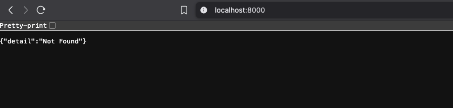
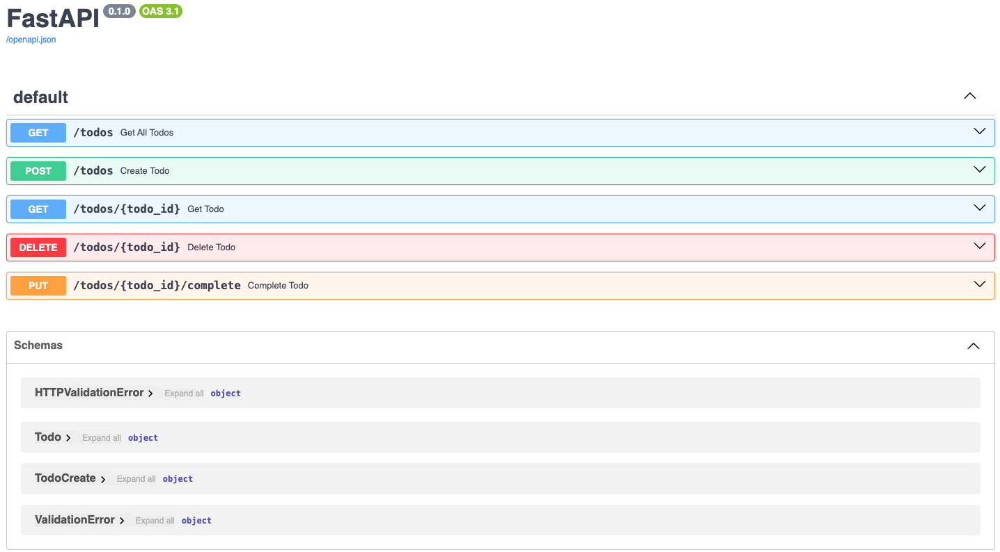
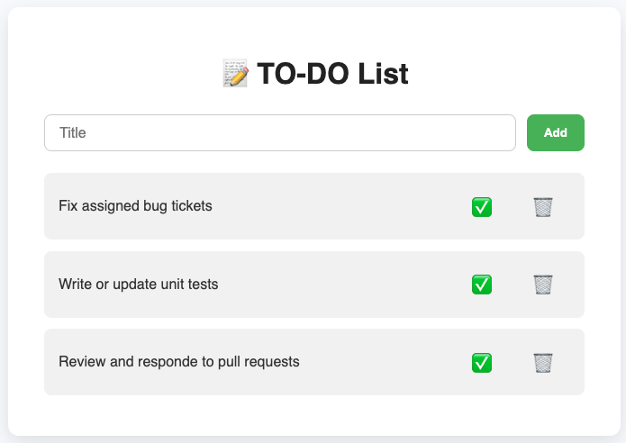

# De la Interfaz al Backend - React y API con Python

Welcome to this beginner-friendly document! At the end of this document, You'll build a simple **TO-DO app** using:

- 🐍 FastAPI (Python) for the backend
- ⚛️ React + Vite + TypeScript for the frontend
- 💾 In-memory cache (no database!)

where You'll be able to:

- Add a TO-DO
- View all TO-DOs
- Delete a TO-DO
- Mark a TO-DO as completed

## Prerequisites

- Python 3.12+ installed.
- Node.js (e.g. v22.16.0) installed.

In order to validate both Python and Node.js are installed, please follow next commands:

```bash
> python --version
Python 3.12.11
> node --version
v22.16.0
```

Create your application root folder where you can save your backend and frontend applications:

```bash
mkdir todo_app
cd todo_app
```

## Backend: FastAPI + In-memory cache

Before you start working on your backend application, please create your backend application folder and place you in it:

```bash
mkdir todo_backend
cd todo_backend
```

### 1. ✅ Create a Python virtual environment

In your Python virtual environment, You will install all python packages needed for your backend:

```bash
python -m venv venv
source venv/bin/activate  # On Windows: venv\Scripts\activate
```

### 2. 📦 Install FastAPI and Uvicorn

Once your Python virtual environment is activated, please install `FastAPI` and `Uvicorn` packages:

```bash
pip install fastapi uvicorn[standard]
```

### 3. 📝 Create Backend using FastAPI

Backend will have following structure:

```text
todo_backend/
├── main.py
├── models.py
├── service.py
└── todo_store.py
```

First let's create the models in `model.py`, models are used for typing validation across the backend application:

```python
# model.py
from pydantic import BaseModel

class TodoCreate(BaseModel):
    title: str

class Todo(TodoCreate):
    id: str
    completed: bool = False

```

Then create the store TodoStore `todo_store.py`, class `TodoStore` will manage CRUD operations to our TO-DO dataset acting as storage:

```python
# todo_store.py
from uuid import uuid4
from models import Todo, TodoCreate

class TodoStore:
    def __init__(self):
        self.todos : list(Todo) = []

    def get_all(self):
        return self.todos

    def get_by_id(self, todo_id: str):
        return next((t for t in self.todos if t.id == todo_id), None)

    def add(self, todo: TodoCreate):
        _todo = Todo(**todo.dict(), id=str(uuid4()))
        self.todos.append(_todo)
        return _todo

    def delete(self, todo_id: str):
        self.todos = [t for t in self.todos if t.id != todo_id]

    def mark_completed(self, todo_id):
        for todo in self.todos:
            if todo.id == todo_id:
                todo.completed = True
        return self.get_by_id(todo_id)

```

After create the service layer in `service.py`, it will be our layer to manage Storage client(e,g, DB client, TodoStore class):

```python
# service.py
from models import Todo, TodoCreate
from todo_store import TodoStore

store = TodoStore()

class TodoService:
    def get_all(self) -> list[Todo]:
        return store.get_all()

    def get_by_id(self, todo_id: str) -> Todo | None:
        return store.get_by_id(todo_id)

    def add(self, todo: TodoCreate) -> Todo:
        return store.add(todo)

    def delete(self, todo_id: str) -> None:
        return store.delete(todo_id)

    def mark_completed(self, todo_id: str) -> Todo | None:
        return store.mark_completed(todo_id)

todo_service = TodoService()

```

Finally please create `main.py` file where API is initialized and all its routes are defined:

```python
# main.py
from fastapi import FastAPI, HTTPException
from fastapi.middleware.cors import CORSMiddleware
from pydantic import BaseModel
from typing import Dict
from models import Todo, TodoCreate
from services import todo_service

app = FastAPI()

# Allow CORS from frontend
app.add_middleware(
    CORSMiddleware,
    allow_origins=["*"],  # Frontend origin
    allow_credentials=True,
    allow_methods=["*"],
    allow_headers=["*"],
)

@app.get("/todos")
def get_all_todos() -> list[Todo]:
    return todo_service.get_all()

@app.post("/todos")
def create_todo(todo: TodoCreate) -> Todo:
    return todo_service.add(todo)

@app.get("/todos/{todo_id}")
def get_todo(todo_id: str) -> Todo:
    todo = todo_service.get_by_id(todo_id)

    if not todo:
        raise HTTPException(status_code=404, detail="Todo not found")

    return todo

@app.delete("/todos/{todo_id}")
def delete_todo(todo_id: str) -> None:
    todo = todo_service.get_by_id(todo_id)

    if not todo:
        raise HTTPException(status_code=404, detail="Todo not found")
    
    return todo_service.delete(todo_id)

@app.put("/todos/{todo_id}/complete")
def complete_todo(todo_id: str) -> Todo:
    todo = todo_service.get_by_id(todo_id)

    if not todo:
        raise HTTPException(status_code=404, detail="Todo not found")

    return todo_service.mark_completed(todo_id)

```

### 4. 🚀 Run the backend server

In order to run FastAPI backend server, the following command should be executed in your terminal:

```bash
uvicorn main:app --reload
```

Now your backend is running at: <http://localhost:8000>



and OpenAPI docs can be found at: <http://localhost:8000/docs>



## 💻 Frontend: React + Vite + TypeScript

### 1. 🛠 Create a Vite React project

Make sure you have Node.js installed: https://nodejs.org
and you are in `todo_app` folder level.

```bash
npm create vite@latest todo_frontend -- --template react-ts
cd todo_frontend
npm install
npm install axios
```

Frontend will have following structure:

```text
todo_frontend/
├── src/
│   ├── App.tsx
│   ├── App.css
│   ├── components/TodoItem.tsx
│   ├── index.css
│   ├── main.tsx
```

### 2. Implement TO-DO Web App in initial react project

First let's create the `TodoItem` component in `src/components/TodoItem.tsx`, this react component will manage existing todo actions (display/mark-as-completed/delete a todo):

```tsx
import React from 'react';

function TodoItem({ todo, onDelete, onComplete }) {
  return (
    <div className={`todo-item ${todo.completed ? "done" : ""}`}>
      <span>{todo.title}</span>
      
      {!todo.completed && <button disabled={todo.completed} onClick={() => onComplete(todo.id)}>✅</button>}
      <button onClick={() => onDelete(todo.id)}>🗑️</button>
    </div>
  );
}

export default TodoItem;
```

Then let's implement a nice style to TO-DO app in `src/index.css`, replace all styles with the following:

```css
/* Global Styles */
body {
  font-family: 'Inter', 'Segoe UI', sans-serif;
  background-color: #f7f9fc;
  margin: 0;
  padding: 0;
  color: #333;
}

.container {
  max-width: 600px;
  margin: 3rem auto;
  padding: 2rem 2.5rem;
  background: #fff;
  border-radius: 12px;
  box-shadow: 0 8px 24px rgba(0, 0, 0, 0.1);
  transition: box-shadow 0.3s ease-in-out;
}

.container:hover {
  box-shadow: 0 12px 32px rgba(0, 0, 0, 0.15);
}

h1 {
  text-align: center;
  font-size: 2rem;
  margin-bottom: 1.5rem;
  color: #222;
}

.input-container {
  display: flex;
  gap: 0.75rem;
  margin-bottom: 1.5rem;
}

input {
  flex: 1;
  padding: 0.65rem 1rem;
  border-radius: 8px;
  border: 1px solid #ccc;
  font-size: 1rem;
  transition: border-color 0.2s;
}

input:focus {
  border-color: #4CAF50;
  outline: none;
  box-shadow: 0 0 0 3px rgba(76, 175, 80, 0.2);
}

button {
  padding: 0.65rem 1.2rem;
  border: none;
  background: #4CAF50;
  color: white;
  border-radius: 8px;
  font-weight: bold;
  cursor: pointer;
  transition: background-color 0.3s ease;
}

button:hover {
  background-color: #45a049;
}

.todo-item {
  display: flex;
  justify-content: space-between;
  align-items: center;
  background: #f1f1f1;
  padding: 0.75rem 1rem;
  border-radius: 8px;
  margin-bottom: 0.8rem;
  transition: background-color 0.3s ease;
}

.todo-item:hover {
  background: #e0e0e0;
}

.todo-item span {
  flex: 1;
  font-size: 1rem;
}

.todo-item.done span {
  text-decoration: line-through;
  color: #888;
}

.todo-item button {
  background: none;
  border: none;
  margin-left: 0.5rem;
  font-size: 1.2rem;
  cursor: pointer;
  transition: transform 0.2s ease;
}

.todo-item button:hover {
  transform: scale(1.2);
}

.todo-item button:first-of-type {
  color: #4CAF50;
}

.todo-item button:last-of-type {
  color: #e53935;
}

```

Finally replace `src/App.tsx` with:

```tsx
import { useEffect, useState } from 'react';
import axios from 'axios';
import TodoItem from './components/TodoItem';

interface Todo {
  id: string;
  title: string;
  completed: boolean;
}

const API = "http://localhost:8000";


function App() {
  const [todos, setTodos] = useState<Todo[]>([]);
  const [title, setTitle] = useState<string>("");

  const fetchTodos = async () => {
    const res = await axios.get(`${API}/todos`);
    setTodos(res.data);
  };

  const addTodo = async () => {
    if (!title) return;

    await axios.post(`${API}/todos`, { title });
    setTitle("");
    fetchTodos();
  };

  const deleteTodo = async (id: string) => {
    await axios.delete(`${API}/todos/${id}`);
    fetchTodos();
  };

  const markCompleted = async (id: string) => {
    await axios.put(`${API}/todos/${id}/complete`);
    fetchTodos();
  };

  useEffect(() => {
    fetchTodos();
  }, []);

  return (
    <div className="container">
      <h1>📝 TO-DO List</h1>
      <div className="input-container">
        <input value={title} placeholder="Title" onChange={e => setTitle(e.target.value)} />
        <button onClick={addTodo}>Add</button>
      </div>
      {todos.map(todo => (
        <TodoItem key={todo.id} todo={todo} onDelete={deleteTodo} onComplete={markCompleted} />
      ))}
    </div>
  );
}

export default App;

```

### 3. 🚀 Run the frontend

```bash
npm run dev
```

Your app is now live at: <http://localhost:5173>




## 🔄 API Endpoints (for developers)

| Method | Endpoint      | Description       |
| ------ | ------------- | ----------------- |
| GET    | `/todos`      | Get all todos     |
| POST   | `/todos`      | Create a new todo |
| GET    | `/todos/{id}` | Get a todo by its id      |
| PUT    | `/todos/{id}/complete` | Mark a todo as completed     |
| DELETE | `/todos/{id}` | Delete a todo     |

## 🧪 Test it

### 1. Start the backend

```bash
cd todo_backend
uvicorn main:app --reload
```

### 2. Start the frontend

```bash
cd todo_frontend
npm run dev
```

### 3. Open your browser and go to: http://localhost:5173

✅ You Did It!
You now have a working fullstack TODO app using:

FastAPI backend with in-memory cache

React + Vite + TypeScript frontend with Axios

CORS properly configured

🎉 Well done! You just built a mini full-stack app from scratch!

## ✅ Pros & ❌ Trade-offs

| Perspective               | Advantages                                                                                                  | Trade-offs                                                                                  |
|--------------------------|--------------------------------------------------------------------------------------------------------------|---------------------------------------------------------------------------------------------|
| Frontend/Backend Separation | Clean architecture, ideal for scaling, separate deploy pipelines. Perfect for Docker/Kubernetes setups. Easy to migrate to microservices. | Two codebases = more complexity in small teams. Needs careful CORS handling.               |
| Performance & Development Speed | FastAPI (async I/O) is fast; Vite provides instant feedback in dev. Speeds up build-test cycles.           | Async Python can increase learning curve.                                                  |
| Type Safety              | Pydantic (Python) + TypeScript reduce runtime bugs. Improves code clarity and refactoring.                 | Requires discipline and upfront effort to set up types and validation schemas.            |
| API docs                 | OpenAPI auto-docs for free. Great for mobile apps, microservices, 3rd-party API consumers.                  | APIs must be versioned and managed carefully over time.                                   |
| Business                 | Common use for MVPs & Startups since it’s easy to setup and scale later without rework. <br>Used for Internal Tools/Dashboards due to Rich UI + fast backend. |                                                                                             |

---

## 🧠 Use Cases

Following use cases are some of most common

- Admin dashboards and internal tools
- Single Page Applications (SPAs)
- RESTful APIs with modern UIs
- Microservices-based apps
- Lightweight frontends for ML/AI backends